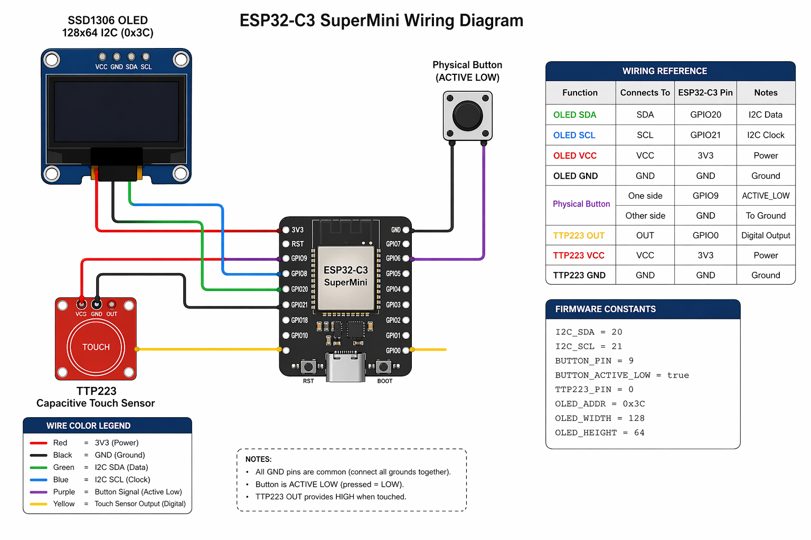

# Notificator Project IoT Firmware (Early Access Devices)

This repository contains the firmware used by the Notificator Project Early Access devices.

Important: This repository is published for reference/transparency. It is not a production-ready build as-is and includes placeholder configuration values.

The firmware file is:
- `notificator_project_early_access_firmware.ino`

## What This Firmware Does

This firmware runs on an ESP32-C3 device with an SSD1306 OLED and a TTP223 capacitive touch sensor.

Core capabilities:
- Connects to Wi-Fi using a setup portal (WiFiManager).
- Connects to MQTT and receives message payloads for display.
- Stores recent message history in device preferences (ring buffer).
- Shows idle screens (clock/weather) and a message viewer UI.
- Supports signed OTA command flow (when configured).

## Hardware Target

Designed for:
- ESP32-C3 SuperMini
- SSD1306 OLED (128x64, I2C, address `0x3C`)
- TTP223 capacitive touch sensor
- One physical button

## GPIO / Wiring Reference

Based on the firmware pin definitions:

Note: The wiring image above is AI-generated. Physical pin placement may differ depending on the exact microcontroller board/module you use. Use the GPIO numbers in this README and firmware as the source of truth.

- OLED SDA -> GPIO20
- OLED SCL -> GPIO21
- Physical button -> GPIO9 (`ACTIVE_LOW`)
- TTP223 digital output -> GPIO0

Firmware constants:
- `I2C_SDA = 20`
- `I2C_SCL = 21`
- `BUTTON_PIN = 9`
- `BUTTON_ACTIVE_LOW = true`
- `TTP223_PIN = 0`
- `OLED_ADDR = 0x3C`
- `OLED_WIDTH = 128`
- `OLED_HEIGHT = 64`

## Gesture Controls

The firmware merges input from the physical button and capacitive sensor.

Normal mode gestures:
- 1 tap: mark current message as read
- 2 taps: show next message
- 3 taps: toggle current message read/unread
- Hold >= 2 seconds: clear all messages
- Hold >= 6 seconds: start setup portal
- 4+ taps: show device ID + firmware version
- 1 tap while ID/version overlay is visible: close overlay
- 8+ capacitive-only taps: start setup portal

Gesture timing constants:
- Tap window: `700 ms`
- Minimum press to count as tap: `25 ms`

## Setup Portal

If Wi-Fi is not configured (or setup is triggered by gesture), the device starts a Wi-Fi configuration portal.

AP naming format:
- `WPNOTIF-<deviceId>`

## Software Requirements

To build in Arduino IDE or PlatformIO, you need:
- ESP32 Arduino core
- WiFiManager
- PubSubClient
- ArduinoJson
- Adafruit GFX Library
- Adafruit SSD1306

## Configuration Notes

This public repo is intended to show firmware structure and behavior.

Before using on real devices, configure at minimum:
- MQTT host/username/password
- Telemetry API URL/token (if telemetry is enabled)
- OTA shared token and allowed host suffix
- Any environment-specific certificates/endpoints

## Version Info

Current firmware metadata in source:
- Firmware name: `Notificator Project IoT Device Firmware`
- Firmware version: `1.0.1`
- Firmware date: `2026-04-13`

## License

This project is licensed under the Apache License 2.0.

See the `LICENSE` file for the full license text.
